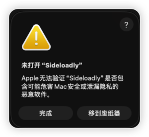
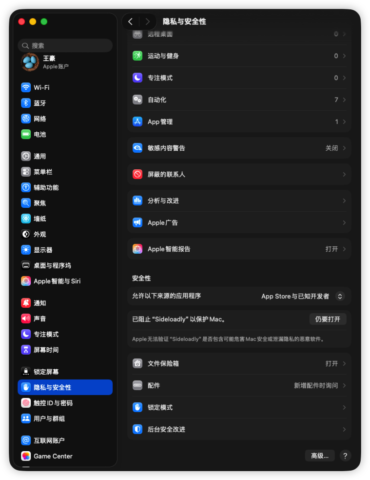

# XCode 安装已签名的 IPA

**Last updated:** February 1, 2025

## SideStore / AltStore 笔记：App ID 限制与 IPA 安装

<!--  -->

## 1. App ID 限制说明 (Apple 免费开发者账号)

这是 Apple 免费开发者账号的 App ID 周限额触发问题（SideStore/AltStore 机制相同）。

*   **10 App IDs / 7 天**：在任意滚动 7 天内，最多只能新注册 10 个 App ID。
*   **1 App ≠ 1 App ID**：只要 IPA 包含 Extensions（扩展），就会额外占用 App ID。SideStore 文档说明 App ID 数取决于扩展数量，且通常一周后才过期。
*   **实例分析 (MeTube)**：MeTube 通常需要 3 个 App ID（主 App + 2 个扩展），因此如果没有足够的剩余名额（例如剩余 0），则无法安装。

### 提示解读
> "You can register another App ID in 3 days."

这意味着按 SideStore 当前统计，最早需要等待 **3 天后** 才会自然释放至少 1 个 App ID 名额。

---

## 2. 解决方案 (按优先级排序)

### 方案 1：等待自然释放 (最稳妥)
到 SideStore `My Apps` -> `View App IDs` 查看每个 ID 的到期时间。
*   **注意**：3 天后可能只释放 1 个名额。如果 MeTube 需要 3 个，可能需要等待更久，直到累计释放 ≥3 个。

### 方案 2：启用 "扩展复用主 App ID"
SideStore 允许扩展复用主 App 的 ID，从而实现 "每个 App 只占用 1 个 App ID"。
*   **操作**：安装 IPA 弹窗时：
    *   ✅ 选择：`Keep App Extensions (Use Main Profile)`
    *   ❌ 不选：`Register App ID for Each Extension`
*   **⚠️ 副作用**：极少数情况下可能导致扩展功能异常（如文件选择器）。
*   **前提**：即便如此，你当前仍需至少 1 个可用名额才能开始安装。

### 方案 3：删除已侧载 App (不一定有效)
App IDs 通常不能手动立即释放。删除 App 后只是不再续期，需等待当前周期结束（7天）才会释放名额。

### 方案 4：彻底解决
*   **付费账号**：加入 Apple Developer Program（$99/年），解除 3 个 App 和 10 个 App ID 的限制。
*   **更换 Apple ID**：可以使用另一个 Apple ID 侧载，但设备本身仍受“免费账号可激活 App 数”的限制。

---

## 3. 如何查看已注册的 App IDs

在 SideStore 中可以直接查看当前 Apple ID 占用的 App ID 列表。

### 方法 1：从设置入口
1. 打开 SideStore -> `Settings` (设置)
2. 点击你的 Apple ID / Account
3. 选择 `View App IDs` (或类似选项)
   * 显示内容包括：App ID (Bundle ID) 及 创建/到期时间。

### 方法 2：从 My Apps 入口
1. 打开 SideStore -> `My Apps`
2. 点击右上角齿轮 `⚙️` 或菜单
3. 选择 `View App IDs`

*注：一个应用可能对应多个 App ID（主程序+插件），数量通常多于已安装的 App 数。*

---

## 4. 如何通过 Xcode 安装已签名的 IPA

<!--  -->

如果 IPA 已经签名，可以直接通过 Xcode 安装到真机，无需重新编译。

### 方法 1：Xcode 设备管理 (推荐)
1. 连接 iPhone 并“信任此电脑”。
2. 打开 Xcode -> `Window` -> `Devices and Simulators`。
3. 左侧选择你的设备 (Devices)。
4. 在右侧 **Installed Apps** 区域点击 `+` 号。
5. 选择你的 `.ipa` 文件。
   * *如果无法选择 IPA，可将其后缀改为 `.zip` 解压，提取 `Payload/YourApp.app`，然后拖入 Installed Apps 列表。*

### 方法 2：命令行 (Xcode 15+)
使用 `devicectl` 工具：
```bash
xcrun devicectl list devices
xcrun devicectl device install app --device <UDID> /path/to/your.ipa
```

### 常见安装失败原因
*   **UDID 不匹配**：签名描述文件未包含该手机的 UDID（Ad Hoc/Development 签名必需）。
*   **证书问题**：证书过期或被撤销。
*   **开发者模式**：iOS 16+ 需开启开发者模式 (`设置` -> `隐私与安全性` -> `开发者模式`)。


<!--  -->
